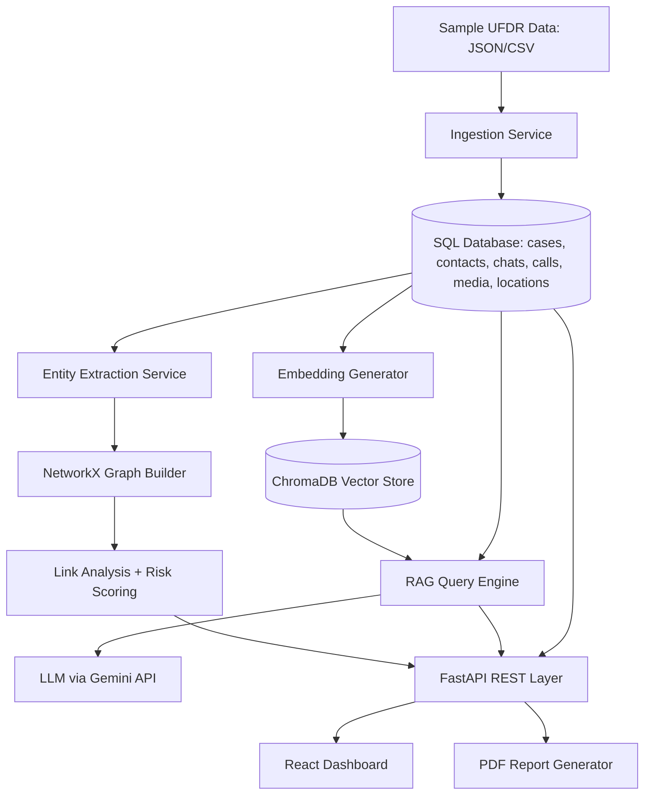
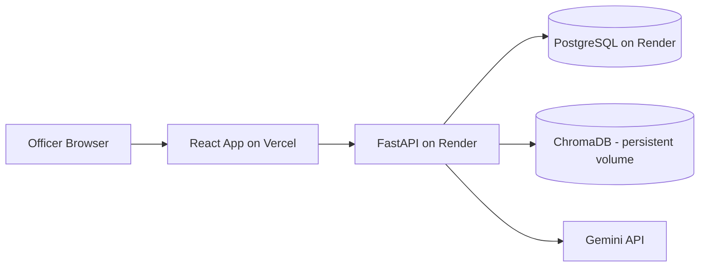

# Architecture — AI-Based UFDR Forensic Intelligence and Link Analysis Platform

## 1. System Overview

This system ingests forensic data exports (modeled on UFDR — Universal Forensic
Extraction Device Report — output from tools like Cellebrite/Magnet AXIOM),
structures it into a relational database, indexes it for semantic search, and
exposes it through a natural-language query interface, a link-analysis graph,
and an auto-generated report builder.

The core design principle: **every AI-generated answer must be traceable back
to a specific evidence record.** This is not a generic chatbot — it is a
retrieval system where the LLM's job is to summarize and explain, never to be
the source of truth.

## 2. Data Flow (Mermaid)

## 3. Backend Architecture

- **API layer** (`app/api/v1/`): thin FastAPI routers, one file per resource
  (cases, search, query, graph, reports, auth).
- **Service layer** (`app/services/`): all business logic — parsing,
  embedding, RAG, graph building, risk scoring. Routers call services; they
  never contain logic themselves. This separation is what lets you swap, say,
  Gemini for OpenAI without touching a single router.
- **Model layer** (`app/models/`): SQLAlchemy ORM models, one source of truth
  for schema.
- **Schema layer** (`app/schemas/`): Pydantic request/response models —
  intentionally separate from ORM models so the API contract can evolve
  independently of the database schema.

## 4. Database Schema (initial — finalized in Phase 2)

Core entities:
- `Case` — investigation container (case number, IO assigned, status)
- `Contact` — a person/number appearing in the data
- `Chat` — message record (sender, receiver, timestamp, content, app source)
- `Call` — call log record (caller, callee, timestamp, duration, type)
- `Media` — image/video/doc metadata (filename, hash, EXIF, GPS, timestamp)
- `Location` — GPS point records (lat, lon, timestamp, source)
- `Entity` — extracted entity (type: phone/email/crypto/name/location, value, source record link)

All evidentiary tables carry a `case_id` foreign key and a `source_record_id`
reference so any answer or graph edge can be traced back to its origin row —
this is the backbone of the "evidence traceability" requirement.

## 5. Vector Search Flow

1. On ingestion, chat/media-caption/document text is chunked and embedded via
   `sentence-transformers/all-MiniLM-L6-v2` (local, no external API call).
2. Embeddings stored in ChromaDB with metadata: `case_id`, `record_type`,
   `source_record_id`, `timestamp`.
3. Queries are embedded the same way and matched via cosine similarity,
   filtered by `case_id` so cases never leak into each other's search space.

## 6. RAG Flow

1. IO submits a natural-language question scoped to a case.
2. Query embedded → top-k relevant chunks retrieved from ChromaDB.
3. Retrieved chunks + their source metadata assembled into a grounded prompt.
4. LLM (Gemini API, abstracted behind an `LLMProvider` interface) generates an
   answer **constrained to only use the retrieved context**, with citations
   back to `source_record_id`s.
5. API response includes the answer text AND the list of evidence records
   used — the frontend renders these as clickable references.

## 7. Link Analysis Flow

1. After ingestion, a graph is built where nodes = contacts/phone numbers and
   edges = communication events (calls, chats), weighted by frequency and
   recency.
2. NetworkX computes centrality metrics (degree, betweenness) to surface key
   players.
3. Graph exported as JSON for the frontend's force-directed graph view.
4. Suspicious-pattern rules (Phase 9) run over this graph plus tabular data
   (e.g., burst communication before/after an event, communication with known
   flagged numbers, odd-hour call clusters) to feed the risk score.

## 8. Deployment Architecture

Local development uses Docker Compose to run backend + frontend + Postgres
together with one command.

## 9. Scalability Plan

| Concern | MVP approach | Production-scale approach |
|---|---|---|
| Database | SQLite | PostgreSQL (migration documented) |
| Vector store | Local ChromaDB | Qdrant managed cluster |
| Large file ingestion | Synchronous, small sample sets | Celery/RQ background workers, chunked processing |
| File storage | Local disk | S3-compatible object storage |
| Concurrency | Single process | Multiple FastAPI workers behind a load balancer, async I/O throughout |
| Rate limiting | None | API gateway-level limiting (e.g., slowapi) |
| Caching | None | Redis cache for repeated queries/graph computations |

## 10. Security Considerations

- All sample data is synthetic — no real case or personal data is ever used.
- JWT-based auth with officer/admin roles; case data scoped per authenticated
  user's permissions.
- In a real deployment: encryption at rest for the database and vector store,
  full audit logging of every query (chain-of-custody requirement for
  forensic tools), and strict input validation on all ingested file formats
  to avoid parser exploits.
